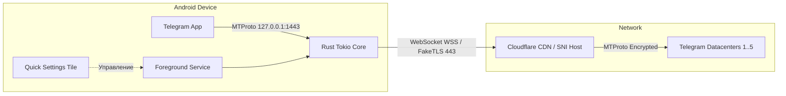

# ⚡ TgwsProxyAndroid

**Высокопроизводительный локальный MTProto WebSocket / FakeTLS прокси для Telegram на Android**

[](https://github.com/wqeww0001/TgwsProxyAndroid/releases/latest)
[-34d399?style=flat-square&logo=android)](https://developer.android.com)
[](https://www.rust-lang.org/)
[](https://developer.android.com/jetpack/compose)
[](LICENSE-GPLv3)
[](https://github.com/wqeww0001/TgwsProxyAndroid/releases)

[**Скачать APK (Релизы)**](https://github.com/wqeww0001/TgwsProxyAndroid/releases/latest) • [**Инструкция**](#-быстрый-старт) • [**Возможности**](#-ключевые-возможности) • [**Сборка**](#-сборка-из-исходников) • [**English Summary**](#-english-summary)

---

## 📖 О проекте

**TgwsProxyAndroid** — это клиентское Android-приложение со встроенным асинхронным **Rust-ядром**, которое запускает изолированный локальный MTProto-прокси прямо на вашем телефоне.

Приложение маскирует трафик Telegram под обычные защищенные HTTPS/WebSocket соединения (FakeTLS / Cloudflare CDN), обеспечивая стабильный доступ к Telegram в условиях блокировок, нестабильного мобильного интернета и строгих сетевых ограничений.

---

## ✨ Ключевые возможности

### 🚀 Производительность и транспорт
- **Ядро на Rust + Tokio**: многопоточная неблокирующая обработка сокетов через JNA-мост с минимальным потреблением оперативной памяти и околонулевой задержкой.
- **Пул WebSocket-соединений**: автоматический прогрев каналов, keepalive-пинги, моментальное восстановление при смене Wi-Fi / LTE и умный fallback на прямой TCP.
- **Поддержка Cloudflare CDN & FakeTLS**: гибкая маскировка под популярные SNI-домены (`yandex.ru`, `vk.com`, `cloudflare.com` и др.) без утечки метаданных.

### 🔋 Энергоэффективность и фоновая работа
- **Умный режим сна (Smart Standby)**: сервис отслеживает состояние экрана — при выключенном дисплее и отсутствии трафика интервал фонового опроса снижается до 30 секунд (экономия до **95% заряда батареи**). При включении экрана или поступлении сообщения сервис просыпается мгновенно.
- **Foreground Service**: стабильная работа в фоне без выгрузки системой Android и автоматический автозапуск при включении устройства (Boot Receiver).

### 📱 Удобство и современный интерфейс
- **Плитка в шторке (Quick Settings Tile)**: переключение прокси в **1 клик** прямо из панели быстрых настроек Android с отображением текущего статуса.
- **Раздача по Wi-Fi (LAN Mode `0.0.0.0`)**: возможность делиться прокси с компьютером, ноутбуком или планшетом в домашней локальной сети.
- **Встроенный QR-код**: мгновенное подключение других устройств через сканирование QR-кода камерой Telegram.
- **Тест задержки доменов (Domain Benchmark)**: встроенная проверка пинга TLS-доменов и выбор наилучшего маршрута в 1 тап.
- **Готовые профили (Пресеты)**: быстрое переключение между режимами *«🚀 Скорость»*, *«🛡️ Скрытный»* и *«🔋 Эко»*.
- **Импорт и экспорт настроек**: перенос и резервное копирование конфигураций через JSON или ссылки `tg://proxy`.
- **Статистика трафика**: раздельный учет переданных данных (↓ / ↑) за сегодня и за все время.
- **Минималистичный дизайн**: интерфейс на **Jetpack Compose** в строгом матовом стиле без лишних GPU-анимаций и нагрева.

### 🔒 Безопасность
- **Аппаратное шифрование (Android Keystore)**: секрет прокси генерируется локально и шифруется алгоритмом **AES-GCM** с неэкспортируемым аппаратным ключом.
- **Безопасные автообновления**: встроенный апдейтер сверяет хэш цифровой подписи APK перед установкой новой версии.

---

## 🛠️ Схема работы



---

## 🚀 Быстрый старт

1. Скачайте актуальный APK-файл со страницы **[Релизов (Releases)](https://github.com/wqeww0001/TgwsProxyAndroid/releases/latest)**.
2. Установите и откройте приложение.
3. Нажмите кнопку **«Запустить»** на главном экране.
4. Нажмите **«Открыть в Telegram»** и подтвердите подключение прокси в появившемся диалоге Telegram.
5. *(Опционально)* Добавьте плитку **TgwsProxy** в верхнюю шторку быстрых настроек Android для управления в 1 тап.

---

## ⚙️ Настройки и параметры

| Параметр | Описание | По умолчанию |
| :--- | :--- | :--- |
| **FakeTLS Domain** | Домен для SNI-маскировки рукопожатия TLS | `yandex.ru` / `cloudflare.com` |
| **Cloudflare Worker** | Домен Cloudflare WSS маршрутизатора | Встроенный |
| **Cloudflare Priority** | Приоритетное использование Cloudflare CDN перед прямым WS | Включено |
| **Размер пула (Pool Size)** | Количество параллельных WebSocket соединений (2, 4 или 6) | `4` |
| **Раздача по Wi-Fi (LAN)** | Биндинг на `0.0.0.0` для доступа ПК и других устройств локальной сети | Выключено |
| **Smart Standby** | Снижение активности при выключенном экране без активного трафика | Включено |
| **DC → IP Mappings** | Ручная таблица перенаправления датацентров Telegram (`DC:IPv4`) | По умолчанию |

---

## 🏗️ Сборка из исходников

### Требования
- **Android Studio** Ladybug (или новее) / Android SDK 37
- **Android NDK** `27.2.12479018` или новее
- **JDK 21** (Temurin / OpenJDK)
- **Rust stable** + утилита `cargo-ndk`

### Пошаговая инструкция

1. **Клонируйте репозиторий:**
   ```bash
   git clone https://github.com/wqeww0001/TgwsProxyAndroid.git
   cd TgwsProxyAndroid
   ```

2. **Установите NDK-таргеты Rust и соберите native-библиотеки:**
   ```powershell
   cargo install cargo-ndk --locked
   rustup target add aarch64-linux-android armv7-linux-androideabi x86_64-linux-android
   
   # Сборка .so библиотек для всех архитектур:
   .\build_so.bat
   ```

3. **Запустите тесты и соберите Debug APK:**
   ```powershell
   .\gradlew.bat testDebugUnitTest assembleDebug
   ```
   *Собранный файл:* `app/build/outputs/apk/debug/app-debug.apk`

4. **Сборка подписанного Release APK:**
   Создайте файл `local.properties` в корне проекта (он исключен из Git):
   ```properties
   RELEASE_STORE_FILE=tgwsproxy-release.jks
   RELEASE_STORE_PASSWORD=your_store_password
   RELEASE_KEY_ALIAS=tgwsproxy
   RELEASE_KEY_PASSWORD=your_key_password
   ```
   Выполните:
   ```powershell
   .\gradlew.bat assembleRelease
   ```
   *Собранный файл:* `app/build/outputs/apk/release/app-release.apk`

---

## 🌐 English Summary

**TgwsProxyAndroid** is a high-performance local MTProto proxy client for Telegram on Android powered by an asynchronous **Rust + Tokio** core.

### Highlights:
- **Rust + Tokio Core**: Low memory footprint, zero overhead, and asynchronous socket handling via JNA.
- **WebSocket & FakeTLS**: Bypasses DPI and network filtering using Cloudflare CDN routing and SNI spoofing.
- **Quick Settings Tile**: Start and stop proxy directly from the Android quick settings panel in 1 tap.
- **LAN Wi-Fi Sharing & QR Code**: Share your proxy connection with PC, laptops, and tablets on your local network using interactive QR code scanning.
- **Domain Latency Benchmark**: Live ping benchmark for TLS/CDN endpoints with 1-click apply.
- **Smart Standby Battery Saver**: Intelligently throttles polling when screen is OFF and idle (saving up to 95% battery).
- **Preset Profiles & Backup**: Quick switching between Speed, Stealth, and Eco profiles with JSON/link import & export.
- **Keystore Protection**: Hardware-backed AES-GCM encryption for MTProto secrets.

---

## 🤝 Участие в разработке

Мы рады новым идеям и пул-реквестам! Перед началом работы ознакомьтесь с нашими документами:
- [Руководство по участию (Contributing Guide)](CONTRIBUTING.md)
- [Кодекс поведения (Code of Conduct)](CODE_OF_CONDUCT.md)
- [Политика безопасности (Security Policy)](SECURITY.md)

---

## 📜 Лицензия

Проект распространяется под свободной лицензией **GNU General Public License v3.0 (GPLv3)**. Подробности в файле [LICENSE-GPLv3](LICENSE-GPLv3).
