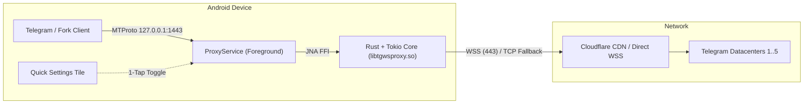

# ⚡ TgwsProxyAndroid

**Высокопроизводительный локальный MTProto WebSocket прокси для Telegram на Android**

[](https://github.com/wqeww0001/TgwsProxyAndroid/releases/latest)
[-34d399?style=flat-square&logo=android)](https://developer.android.com)
[](https://www.rust-lang.org/)
[](https://github.com/wqeww0001/TgwsProxyAndroid)
[](https://developer.android.com/jetpack/compose)
[](LICENSE-GPLv3)
[](https://github.com/wqeww0001/TgwsProxyAndroid/releases)
[](https://github.com/wqeww0001/TgwsProxyAndroid)

[**Промо-сайт**](https://wqeww0001.github.io/TgwsProxyAndroid/) • [**Скачать APK (Релизы)**](https://github.com/wqeww0001/TgwsProxyAndroid/releases/latest) • [**Быстрый старт**](#-быстрый-старт) • [**Возможности**](#-ключевые-возможности) • [**Настройки**](#️-настройки-и-параметры) • [**Сборка**](#️-сборка-из-исходников) • [**English Summary**](#-english-summary)

---

## 📖 О проекте

**TgwsProxyAndroid** — это клиентское Android-приложение со встроенным асинхронным **Rust + Tokio ядром** (`libtgwsproxy.so`), которое поднимает изолированный локальный MTProto-прокси `127.0.0.1:1443` прямо на вашем смартфоне без системного VPN.

Приложение туннелирует трафик датацентров Telegram (`DC 1..5`) поверх защищённых `WSS`-соединений через **Cloudflare CDN** или прямой `WSS` к серверам Telegram (`kws{dc}.web.telegram.org`) с автоматическим прогревом пула и прозрачным fallback на прямой TCP.

---

## ✨ Ключевые возможности

### 🚀 Производительность и протокол
- **Асинхронное ядро на Rust + Tokio (`libtgwsproxy.so`)**: неблокирующая обработка сокетов через JNA-мост с минимальным потреблением памяти и околонулевой задержкой.
- **Гибкая маршрутизация Cloudflare CDN / Direct WSS**: переключатель приоритета (`CF-first` или сначала прямой `WSS` к DC Telegram) и умный fallback на прямой TCP.
- **Пул быстрых WebSocket-соединений**: настраиваемый пул (`2`, `4` или `6` соединений), keepalive-пинги и автоматический перезапуск при переключении между Wi-Fi и мобильной сетью.

### 🔋 Энергоэффективность и фоновая работа
- **Умный режим сна (Smart Standby)**: сервис отслеживает состояние экрана и активный входящий/исходящий трафик (`down` / `up`) — при выключенном дисплее и простое частота фонового опроса снижается до 30 секунд. При появлении трафика или включении экрана активный режим возвращается мгновенно.
- **Foreground Service & Boot Receiver**: стабильная работа в фоне без выгрузки системой Android и опциональный автозапуск после перезагрузки телефона.
- **Плитка в шторке (Quick Settings Tile)**: включение и отключение прокси в **1 тап** прямо из панели быстрых настроек Android.

### 🎨 Современный интерфейс (Material Design 3)
- **4 полноценные темы оформления**: `Светлая (Light)`, `Тёмная (Dark)`, `Аврора (Aurora)` и `Закат (Sunset)` с продуманными цветовыми палитрами и автоматической адаптацией статус-бара.
- **Высокая отзывчивость без лишних рекомпозиций**: изолированное обновление таймера аптайма, версионированный буфер логов и виртуализированный журнал отладки на `LazyColumn`.
- **Центр обновлений и Архив версий (Rollback)**:
  - Переключение между каналами **Стабильная (Stable)** и **Бета / Снапшот (Beta)**.
  - Окно обновлений с форматированным списком изменений и автоматическим перезапуском прокси после установки.
  - Встроенный **Архив всех релизов** с возможностью отката на любую предыдущую версию в 1 клик.
- **Резервное копирование настроек**: экспорт и импорт всей конфигурации прокси в формате JSON или по ссылке.
- **Статистика трафика**: учёт принятых и отправленных данных (`↓` / `↑`) за сегодня и за всё время, включая финальный сброс при остановке сервиса.

### 🔒 Безопасность
- **Аппаратное хранилище ключей (Android Keystore)**: локальный MTProto-секрет генерируется на устройстве и шифруется алгоритмом **AES-GCM** с неэкспортируемым ключом.
- **Очистка ключевого материала (`Drop`)**: ключи и IV потока `AES-CTR` зануляются в памяти Rust по завершении соединения.
- **Проверка целостности и подписи APK**: перед установкой обновления проверяется валидность APK-архива, совпадение `packageName` и криптографического сертификата подписи (`SHA-256`).

---

## 🛠️ Схема работы


```mermaid
graph LR
    subgraph Android Device
        TG["Telegram / Fork Client"] -->|"MTProto 127.0.0.1:1443"| SERVICE["ProxyService (Foreground)"]
        TILE["Quick Settings Tile"] -.->|"1-Tap Toggle"| SERVICE
        SERVICE -->|"JNA FFI"| RUST["Rust + Tokio Core (libtgwsproxy.so)"]
    end

    subgraph Network
        RUST -->|"WSS (443) / TCP Fallback"| CF["Cloudflare CDN / Direct WSS"]
        CF --> DC["Telegram Datacenters 1..5"]
    end
```

---

## 🚀 Быстрый старт

1. Скачайте актуальный APK со страницы **[Релизов (Releases)](https://github.com/wqeww0001/TgwsProxyAndroid/releases/latest)** и установите его.
2. Нажмите **«Запустить»** на главном экране и дождитесь статуса **«Подключено»**.
3. Нажмите **«Открыть в Telegram»** и подтвердите добавление прокси `127.0.0.1:1443`.

> [!WARNING]
> **Если при обновлении возникает ошибка «Update signing certificate mismatch» / «Приложение не установлено»:**
> Удалите старую версию приложения с телефона и установите новый APK со страницы [Releases](https://github.com/wqeww0001/TgwsProxyAndroid/releases/latest) заново. Начиная с актуальных релизов используется единый постоянный ключ подписи, поэтому все последующие обновления будут устанавливаться поверх без удаления.

---

## ⚙️ Настройки и параметры

| Параметр | Описание | По умолчанию |
| :--- | :--- | :--- |
| **Cloudflare домен** | Пользовательский домен для WSS-маршрутизации (пусто = встроенный список + TCP fallback) | Встроенный |
| **Cloudflare CDN** | Использование Cloudflare CDN для обхода DPI | Включено |
| **Приоритет Cloudflare (`CF-first`)** | `Вкл` = сначала CDN-маршрут; `Выкл` = сначала прямой WSS к DC Telegram | Включено |
| **Датацентры Telegram (DC → IP)** | Пользовательское перенаправление датацентров в формате `номерDC:IPv4` | По умолчанию |
| **Пул быстрых соединений** | Количество готовых параллельных WSS-соединений (`2`, `4` или `6`) | `4` |
| **Умный режим сна (Smart Standby)** | Снижение фоновой активности при выключенном экране и отсутствии трафика | Включено |
| **Канал обновлений** | Выбор между `Стабильная (Stable)` и `Бета / Снапшот (Beta)` + архив версий | `Стабильная` |
| **Оформление (Appearance)** | Выбор темы интерфейса: `Светлая`, `Тёмная`, `Аврора`, `Закат` | `Светлая` |

---

## 🏗️ Сборка из исходников

### Требования
- **Android Studio** Ladybug (или новее) / **Android SDK 37**
- **Android NDK** `27.x` или новее
- **JDK 21** (Temurin / OpenJDK)
- **Rust stable** + утилита `cargo-ndk`

### Пошаговая инструкция

1. **Клонируйте репозиторий:**
   ```bash
   git clone https://github.com/wqeww0001/TgwsProxyAndroid.git
   cd TgwsProxyAndroid
   ```

2. **Установите таргеты Rust и соберите native-библиотеки (`libtgwsproxy.so`):**
   ```powershell
   cargo install cargo-ndk --locked
   rustup target add aarch64-linux-android armv7-linux-androideabi x86_64-linux-android

   # Сборка .so библиотек для arm64-v8a, armeabi-v7a и x86_64:
   .\build_so.bat
   ```

3. **Запустите тесты и соберите Debug APK:**
   ```powershell
   .\gradlew.bat testDebugUnitTest assembleDebug
   ```
   *Собранный файл:* `app/build/outputs/apk/debug/app-debug.apk`

4. **Сборка подписанного Release APK:**
   Создайте файл `local.properties` в корне проекта (он исключён из Git):
   ```properties
   RELEASE_STORE_FILE=tgwsproxy-release.jks
   RELEASE_STORE_PASSWORD=your_store_password
   RELEASE_KEY_ALIAS=tgwsproxy
   RELEASE_KEY_PASSWORD=your_key_password
   ```
   Выполните:
   ```powershell
   .\gradlew.bat assembleRelease
   ```
   *Собранный файл:* `app/build/outputs/apk/release/app-release.apk`

---

## 🌐 English Summary

**TgwsProxyAndroid** is a high-performance local MTProto WebSocket proxy client for Telegram on Android powered by an asynchronous **Rust + Tokio** core (`libtgwsproxy.so`) on `127.0.0.1:1443`.

### Highlights:
- **Rust + Tokio Core (`MTProto WS`)**: Routes Telegram DC (`1..5`) traffic over TLS 1.3 WebSockets (`WSS`) with configurable Cloudflare CDN priority (`CF-first` vs direct WSS) and automatic TCP fallback.
- **Smart Standby Battery Saver**: Automatically throttles background polling when the screen is off and no download/upload traffic is active.
- **Material 3 UI & 4 Themes**: Clean Jetpack Compose interface featuring `Light`, `Dark`, `Aurora`, and `Sunset` themes, vector iconography, and a virtualized `LazyColumn` debug log.
- **In-App Updater & Version Archive**: Supports `Stable` and `Beta` update channels, formatted Markdown changelogs, automatic service restart after update, and 1-click rollback to any previous GitHub release.
- **Hardware-Backed Security**: Local MTProto secret encrypted with **AES-GCM** via Android Keystore and APK signing certificate verification (`SHA-256`).

---

## 🤝 Участие в разработке

Мы рады новым идеям, баг-репортам и пул-реквестам! Перед началом работы ознакомьтесь с документами:
- [Руководство по участию (Contributing Guide)](CONTRIBUTING.md)
- [Кодекс поведения (Code of Conduct)](CODE_OF_CONDUCT.md)
- [Политика безопасности (Security Policy)](SECURITY.md)

---

## 📜 Лицензия

Проект распространяется под свободной лицензией **GNU General Public License v3.0 (GPLv3)**. Подробности в файле [LICENSE-GPLv3](LICENSE-GPLv3).
